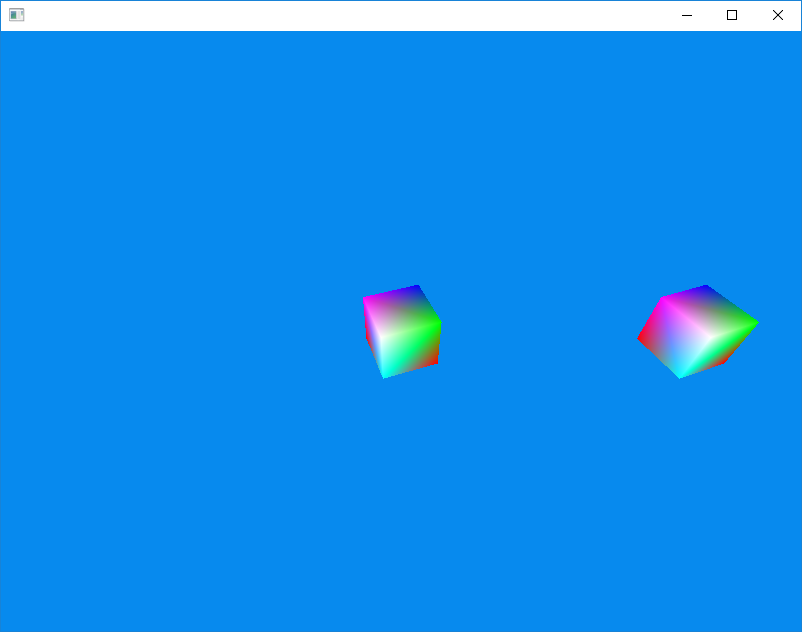

# Hex3D

Hex3D is a 3D game engine written in C++.

This is a hobby project of mine and it is unfinished and not ready for real-world use.
I will not accept pull requests.

# License

Hex3D Copyright (C) 2016-2019 Daniel McGinnis

Hex3D is licensed under the GNU AGPLv3 license as published by the Free Software Foundation.
